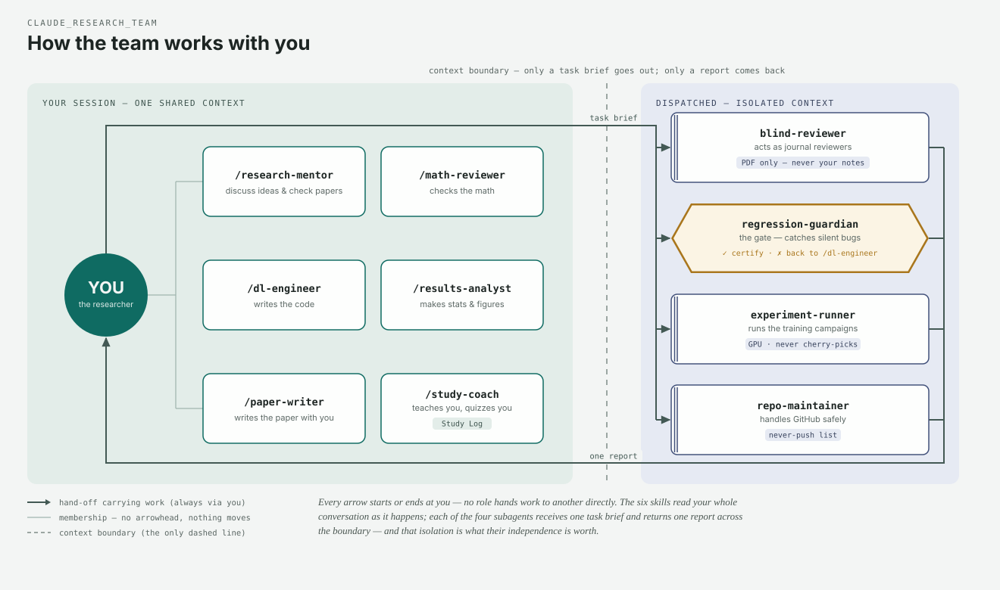
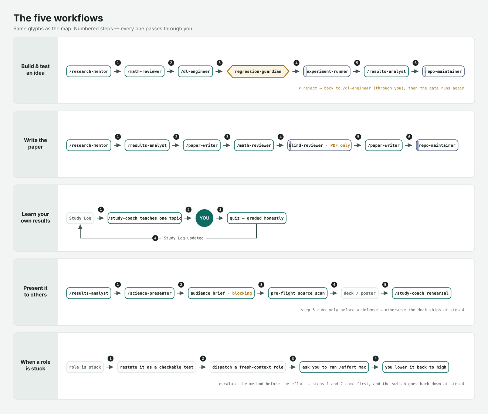

# claude_research_team

**A multi-role Claude Code research team for ML research projects — 7 skills,
4 subagents, and a roster contract.** MIT-licensed templates distilled from a
working solo-research setup.

## The team at a glance



**In one sentence:** seven skills sit *inside* your conversation and see
everything you see, four subagents work *outside* it — you send a task brief
across the boundary, they send back one report — and every hand-off passes
through you.

### Reading the map in detail

- **Enclosure is the message.** The two tinted zones are the diagram's core
  claim: left = one shared context (the skills collaborate with your full
  conversation), right = isolated contexts (the subagents never see it). No
  agent talks to another directly — the map has no agent-to-agent edge at all.
- **The dispatch bus crosses the boundary exactly twice**, labeled `task
  brief` (out) and `one report` (back). That two-arrow interface is the whole
  contract with an isolated role.
- **The hexagon is the gate.** `regression-guardian` is the only hexagon and
  the only amber on the page: after any risky code change it independently
  certifies (✓) or sends the work back (✗ — through you) — the author never
  certifies their own change.
- **Line grammar:** solid arrow = a hand-off carrying work; thin plain line =
  membership (nothing moves); dashed = the context boundary, and nothing else
  is ever dashed.
- **Names tell you the mechanism:** a leading `/` means an in-session skill
  you invoke in the conversation; no slash + a doubled left edge means a
  dispatched, isolated subagent. Small tags carry each role's hard rule
  (`PDF only`, `never-push list`, `GPU · never cherry-picks`, `Study Log`,
  `brief first`).
### The four workflows



*Build-and-test runs through the amber gate (with the ✗-reject loop back to
`/dl-engineer`); the paper loop hands the blind reviewer only the PDF; learning
cycles back into the Study Log so the next session starts where this one ended;
and in the Present lane, verified numbers from `/results-analyst` go to
`/science-presenter`, which asks a blocking audience brief before it builds
anything — for a defense, `/study-coach` runs the rehearsal. Text versions
live in [`RESEARCH_TEAM.md`](RESEARCH_TEAM.md#typical-flows).*

## Why roles?

One assistant doing everything means the author reviews their own bugs, the
reviewer knows the authors' intent, and every session re-derives context. This
team splits the work by **context posture**: *skills* load into your current
conversation (collaborate — design, code, analysis, writing, teaching), while
*subagents* run isolated (dispatch-and-report — independent review,
certification, mechanical ops). Independence is a feature you configure, not a
vibe you hope for.

## The team

| # | Role | Kind | What it's for |
|---|------|------|----------------|
| 1 | `math-reviewer` | skill | verify math, shapes, derivations — never implements |
| 2 | `dl-engineer` | skill | write/debug model + training code — never self-certifies |
| 3 | `research-mentor` | skill | direction debates; verifies claims against the literature |
| 4 | `blind-reviewer` | subagent | memoryless peer-review panel — sees only the PDF |
| 5 | `repo-maintainer` | subagent | git/GitHub with an enforced never-push list |
| 6 | `experiment-runner` | subagent | campaigns, GPU babysitting, no cherry-picking |
| 7 | `results-analyst` | skill | publication-grade stats + figures, honesty doctrine |
| 8 | `regression-guardian` | subagent | independent silent-bug gate; writes missing tests |
| 9 | `paper-writer` | skill | manuscript revision + compile, honest-framing guardrails |
| 10 | `study-coach` | skill | teaches YOU your own project — persistent Study Log, quizzes |
| 11 | `science-presenter` | skill | audience-facing decks/posters — blocking brief, analogy-before-math, never inflates |

Full roster contract with model routing and boundaries: [`RESEARCH_TEAM.md`](RESEARCH_TEAM.md).
Design rationale (why author ≠ certifier, why the reviewer stays blind, the
memory-wins rule): [`docs/design-notes.md`](docs/design-notes.md).

## Install

```bash
git clone https://github.com/brian10420/claude_research_team
cp -r claude_research_team/skills  your-project/.claude/skills
cp -r claude_research_team/agents  your-project/.claude/agents
cp    claude_research_team/RESEARCH_TEAM.md your-project/.claude/
```

Then do the **fill-in pass** — every project-specific slot is marked
`<placeholder>` or `<!-- PROJECT-SPECIFIC -->`:

```bash
grep -rn "PROJECT-SPECIFIC" your-project/.claude/
```

Per-file guidance: [`docs/customization.md`](docs/customization.md). Adjust
each agent's `model:`/`tools:` frontmatter to your plan.

## The study-coach ecosystem

A tutor that keeps a persistent Study Log (curriculum arcs,
quiz results, weak-spot review queue) so learning survives across sessions —
built for "I can run my experiments, now I need to *defend* them" moments.
Seed your log from [`templates/STUDY_LOG_TEMPLATE.md`](templates/STUDY_LOG_TEMPLATE.md);
open lanes with [`templates/session-handoff-prompt.md`](templates/session-handoff-prompt.md).

## The science-presenter (newest role)

The outward-facing lane: turns your results into what outsiders actually
absorb — animated HTML decks, design-canvas posters, one-pagers. Its contract
is the interesting part: a **blocking audience brief** before any design work
("tomorrow" doesn't waive it), a **pre-flight scan** that verifies every
source figure/number file on disk before anything is embedded, an
**analogy → picture → full math** ramp (math may move to backup slides, never
vanishes), and an honesty rail under which simplification may omit but never
inflate. It builds what you show; the study-coach preps *you* — for a defense,
one makes the deck, the other runs the rehearsal. Log deliveries via
[`templates/PRESENTATION_LOG_TEMPLATE.md`](templates/PRESENTATION_LOG_TEMPLATE.md).

## How these were built

Skill files are process documentation, and process documentation lies unless
tested. The study-coach was built RED→GREEN: baseline agent observed failing
(expert-density walls, trap quizzes, no persistence), skill written as a
positive session contract against that exact failure, then verified. The
science-presenter repeated the loop: the baseline refused to block on the
audience question and shipped a jargon deck for an assumed venue; the skill
pins the brief as a blocking gate and was verified to hold it under time
pressure. The story, and when to scale the ceremony up or down:
[`docs/creating-skills-with-tdd.md`](docs/creating-skills-with-tdd.md).

## Companion third-party skills (not vendored — install from upstream)

This team pairs well with, and was developed alongside:

- [mattpocock/skills](https://github.com/mattpocock/skills) — `tdd`,
  `diagnose`, `grill-me`, `grill-with-docs`, `caveman`, `prototype`,
  `zoom-out`, `to-prd`, `to-issues`
- [vercel-labs/skills](https://github.com/vercel-labs/skills) — the skills CLI
  and `find-skills`
- [Anthropic superpowers plugin](https://github.com/anthropics/claude-code) —
  `writing-skills` powered the TDD process above

None of their code is copied here; all attribution and licensing remain
theirs.

## What was removed (honesty note)

These are scrubbed versions of a working configuration from an active,
unpublished ML research project (audio / affective computing). Every metric
value, dataset specific, campaign name, file inventory, and personal detail
was replaced with placeholders or invented generic examples. The **structure
and doctrine are real and battle-tested; the numbers are yours to fill in.**

*Last synced from the private originals: 2026-08-31.*

## License

MIT © [Ting-Yi Lin](https://github.com/brian10420)
